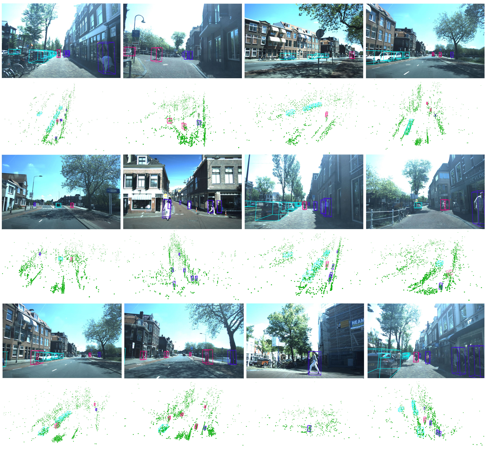

# RCDBF
**RCDBF: Radar and Camera Dual-Level-BEV Fusion for 3D Object Detection**

Peifeng Cheng, Hang Yan, and Luping Wang

## Introduction

This repository is an official implementation of [RCDBF], our novel 4D radar-camera fusion architecture for 3D perception. 

## News
- `[2025/1/10]` Official PyTorch implementation is coming soon.

## Getting Started

## Model Zoo

### 3D Object Detection on [VoD](https://github.com/tudelft-iv/view-of-delft-dataset)
|  Method  | Backbone | 3D EAA mAP  |  3D DAA mAP  |   Config    |   Checkpoint   |
|  :----:  | :------: |    :---:    |     :---:    | :---------: | :------------: |
| RCFusion |   R50    |    49.65    |    69.23     | [config](x) | [model](x.pth) |
|  RCDBF   |   R50    |    56.66    |    70.61     | [config](x) | [model](x.pth) |

### 3D Object Detection on [TJ4DRadSet](https://github.com/TJRadarLab/TJ4DRadSet)
|  Method  | Backbone |    3D mAP   |   BEV mAP    |   Config    |   Checkpoint   |
|  :----:  | :------: |    :---:    |     :---:    | :---------: | :------------: |
| RCFusion |   R50    |    33.85    |    39.76     | [config](x) | [model](x.pth) |
|  RCDBF   |   R50    |    37.93    |    45.61     | [config](x) | [model](x.pth) |

## Citation
If this work is helpful for your research or applications, please consider giving us a star 🌟 and citing it by the following BibTeX entry.

## Acknowledgements

We would like to thank other great open source projects:

- [RCBEVDet](https://github.com/VDIGPKU/RCBEVDet?tab=readme-ov-file), [DualBEV](https://github.com/Divadi/SOLOFusion), [FB-BEV](https://github.com/NVlabs/FB-BEV) , [CRN](https://github.com/youngskkim/CRN)