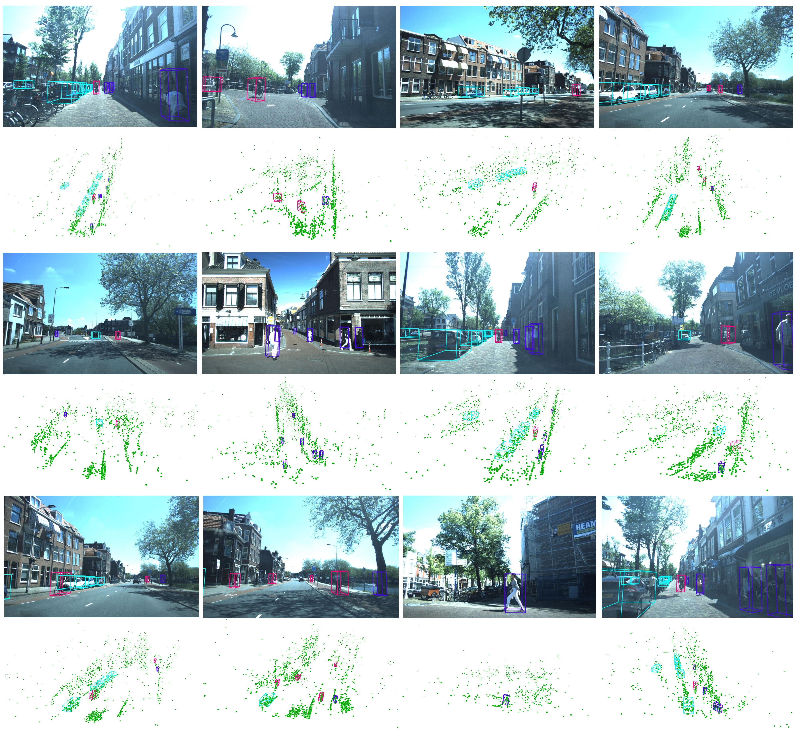

# RCDFNet

**RCDFNet: A 4-D Radar and Camera Dual-Level Fusion Network for 3D Object Detection**

Peifeng Cheng, Hang Yan, Yukang Wang, and Luping Wang

## Introduction

This repository is the official PyTorch implementation of RCDFNet, a 4D radar-camera dual-level fusion architecture for 3D object detection.

<p align="center">

</p>

## News

- `[2025/1/28]` Official PyTorch implementation is coming soon.
- `[2025/5/13]` The paper has been accepted for publication in the IEEE SENSORS JOURNAL.
- `[2026/4/01]` Official PyTorch implementation is open-source.

## Highlights

- Standalone RCDFNet codebase for training, inference, and evaluation.
- Supports VoD and TJ4DRadSet data preparation workflows.
- Includes one-command quick scripts for training and testing.

## Project Structure

- Training entry: `tools/train.py`
- Inference entry: `tools/test.py`
- Inference + evaluation entry for VoD datasets: `tools/all_test_evaluate.py`

## Model Zoo

### 3D Object Detection on [VoD](https://github.com/tudelft-iv/view-of-delft-dataset)

|  Method  | Backbone | 3D EAA mAP  |  3D DAA mAP  |   Config    |   Checkpoint   |
|  :----:  | :------: |    :---:    |     :---:    | :---------: | :------------: |
| RCFusion |   R50    |    49.65    |    69.23     | [config](configs/RCFusion/RCFusion_vod.py) | [model](x) |
|  RCDFNet |   R50    |    56.66    |    70.61     | [config](configs/RCDFNet/RCDFNet_VoD.py) | [model](https://pan.baidu.com/s/1thE_Wt8oNIhn8KGI50GDNQ) password:9z2e |

### 3D Object Detection on [TJ4DRadSet](https://github.com/TJRadarLab/TJ4DRadSet)

|  Method  | Backbone |    3D mAP   |   BEV mAP    |   Config    |   Checkpoint   |
|  :----:  | :------: |    :---:    |     :---:    | :---------: | :------------: |
| RCFusion |   R50    |    33.85    |    39.76     | [config](configs/RCFusion/RCFusion_tj4d.py) | [model](x) |
|  RCDFNet |   R50    |    37.93    |    45.61     | [config](configs/RCDFNet/RCDFNet_TJ4D.py) | [model](https://pan.baidu.com/s/1thE_Wt8oNIhn8KGI50GDNQ) password:9z2e |

## Getting Started

### 1. Environment Setup

The following instructions are based on Linux + Conda. Two options are provided:

- Option A (recommended): create environment from YAML
- Option B: manual installation (compatible with Python 3.8 workflow)

#### 1.1 Enter the project root

```bash
cd /path/to/RCDFNet-main
```

#### 1.2 Option A (recommended): one-command Conda environment

Environment files:

- `environment/conda_RCDFNet.yaml`
- `environment/requirements.txt`

```bash
cd environment
conda env create -f conda_RCDFNet.yaml
conda activate RCDFNet
cd ..
pip install -v -e . --no-build-isolation
```

#### 1.3 Option B: manual installation

1) Create environment

```bash
conda create -n RCDFNet python=3.8 -y
conda activate RCDFNet
```

2) Install PyTorch (CUDA 11.1)

```bash
pip install torch==1.10.1+cu111 torchvision==0.11.2+cu111 torchaudio==0.10.1 -f https://download.pytorch.org/whl/cu111/torch_stable.html
```

3) Install OpenMMLab dependencies

```bash
pip install openmim
mim install mmcv==1.4.0
pip install mmdet==2.14.0
pip install mmsegmentation==0.14.1
```

4) Install Python requirements

```bash
pip install -r requirements/runtime.txt
pip install -r requirements/tests.txt
```

5) Install RCDFNet

```bash
pip install -v -e . --no-build-isolation
```

6) Quick environment check

```bash
python -c "import importlib.util; print('mmcv._ext=', importlib.util.find_spec('mmcv._ext') is not None)"
PYTHONPATH=. python tools/train.py --help
```

### 2. Dataset and Checkpoints Preparation

#### 2.1 Prepare datasets

1) Confirm dataset root paths for VoD and TJ4DRadSet. The pkl converter expects
KITTI-style folders under the dataset root:

```text
<DATA_ROOT>/
|-- ImageSets/
|   |-- train.txt
|   |-- val.txt
|   `-- test.txt
`-- training/
    |-- image_2/
    |-- velodyne/
    |-- calib/
    `-- label_2/
```

`ImageSets/*.txt` should contain one sample id per line, without file suffix.
The converter uses 5-digit `.jpg` files with 7-feature radar points for VoD,
and 6-digit `.png` files with 8-feature radar points for TJ4DRadSet.

2) Generate annotation PKL for VoD from the project root:

```bash
PYTHONPATH=. python tools/extract_vod_tj4d_pkl.py vod \
  --root-path <YOUR_VOD_DATA_ROOT> \
  --extra-tag vod
```

This generates the following files under `<YOUR_VOD_DATA_ROOT>`:

```text
vod_infos_train.pkl
vod_infos_val.pkl
vod_infos_trainval.pkl
vod_infos_test.pkl
training/velodyne_reduced/
```

3) Generate annotation PKL for TJ4DRadSet:

```bash
PYTHONPATH=. python tools/extract_vod_tj4d_pkl.py TJ4DRadSet_4DRadar \
  --root-path <YOUR_TJ4D_DATA_ROOT> \
  --extra-tag TJ4DRadSet_4DRadar
```

This generates the following files under `<YOUR_TJ4D_DATA_ROOT>`:

```text
TJ4DRadSet_4DRadar_infos_train.pkl
TJ4DRadSet_4DRadar_infos_val.pkl
TJ4DRadSet_4DRadar_infos_trainval.pkl
TJ4DRadSet_4DRadar_infos_test.pkl
training/velodyne_reduced/
```

4) Generate depth ground truth used by the RCDFNet pipelines.

For VoD:

```bash
PYTHONPATH=. python tools/gen_depth_gt.py \
  --data-root <YOUR_VOD_DATA_ROOT> \
  --info-paths \
    <YOUR_VOD_DATA_ROOT>/vod_infos_train.pkl \
    <YOUR_VOD_DATA_ROOT>/vod_infos_val.pkl \
    <YOUR_VOD_DATA_ROOT>/vod_infos_test.pkl \
  --num-features 7
```

For TJ4DRadSet:

```bash
PYTHONPATH=. python tools/gen_depth_gt.py \
  --data-root <YOUR_TJ4D_DATA_ROOT> \
  --info-paths \
    <YOUR_TJ4D_DATA_ROOT>/TJ4DRadSet_4DRadar_infos_train.pkl \
    <YOUR_TJ4D_DATA_ROOT>/TJ4DRadSet_4DRadar_infos_val.pkl \
    <YOUR_TJ4D_DATA_ROOT>/TJ4DRadSet_4DRadar_infos_test.pkl \
  --num-features 8
```

The generated files are saved to `training/depth_gt_radar/` under the dataset
root. VoD uses names such as `00001.jpg.bin`; TJ4DRadSet uses names such as
`000001.png.bin`. Existing depth files are not overwritten by default; add
`--overwrite` if you intentionally want to regenerate them.

RCDFNet does not require VoD image segmentation files for training.

If your local config still contains the legacy `LoadSegsFromFile` step and
collects `seg_label`, remove those entries or provide the corresponding
segmentation files.

#### 2.2 Verify dataset paths in config

Please check the following fields in your config files:

- `data_root`
- `ann_file`
- point cloud `load_dim` / `use_dim`

For example, update:

- `configs/RCDFNet/RCDFNet_VoD.py`
- `configs/RCDFNet/RCDFNet_TJ4D.py`

The default configs contain absolute paths from the original training machine;
replace them with your generated `*_infos_train.pkl` and `*_infos_val.pkl`.

#### 2.3 Prepare pretrained/model checkpoints

It is recommended to place checkpoints under:

```text
checkpoint/
```

Example path reference:

- `checkpoint/vod/RCDFNet.pth`

### 3. Quick Run

Run all commands from the project root.

#### 3.1 Show training arguments

```bash
PYTHONPATH=. python tools/train.py --help
```

If you prefer explicit Conda execution:

```bash
PYTHONPATH=. conda run -n RCDFNet --no-capture-output python tools/train.py --help
```

#### 3.2 Quick training

```bash
bash ./scripts/train.sh
```

#### 3.3 Quick testing

```bash
bash ./scripts/test.sh
```

## Citation

If this work is helpful for your research or applications, please consider giving us a star 🌟 and citing it by the following BibTeX entry.

```bibtex
@article{cheng2025rcdfnet,
  title={RCDFNet: A 4-D Radar and Camera Dual-Level Fusion Network for 3D Object Detection},
  author={Cheng, Peifeng and Yan, Hang and Wang, Yukang and Wang, Luping},
  journal={IEEE Sensors Journal},
  year={2025},
  publisher={IEEE}
}
```

## Acknowledgements

We would like to thank the following excellent open-source projects:

- [RCBEVDet](https://github.com/VDIGPKU/RCBEVDet?tab=readme-ov-file)
- [FB-BEV](https://github.com/NVlabs/FB-BEV)
- [CRN](https://github.com/youngskkim/CRN)
